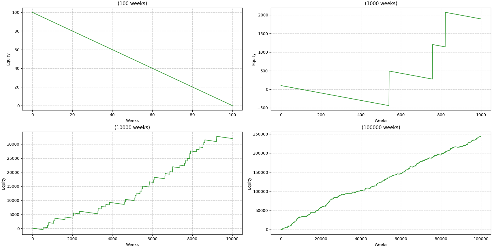
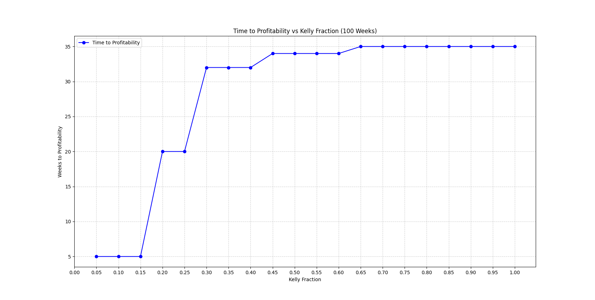
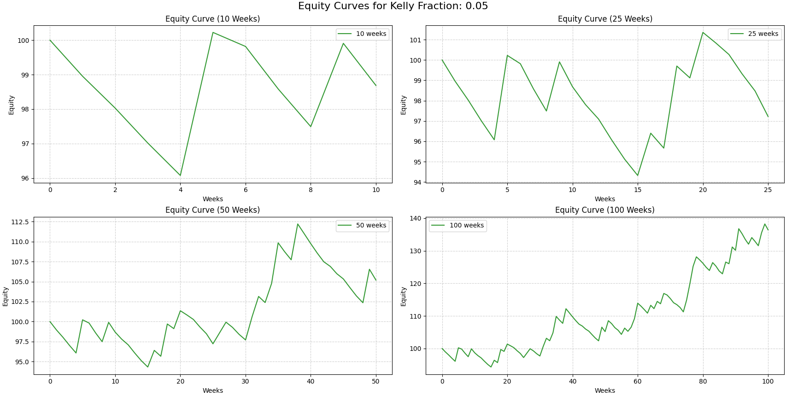
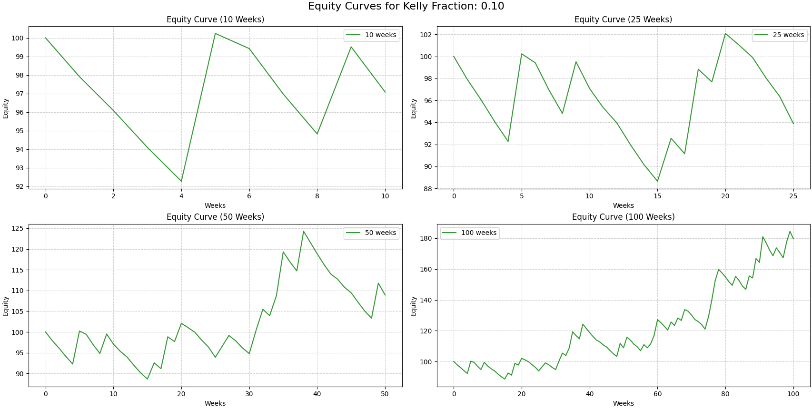
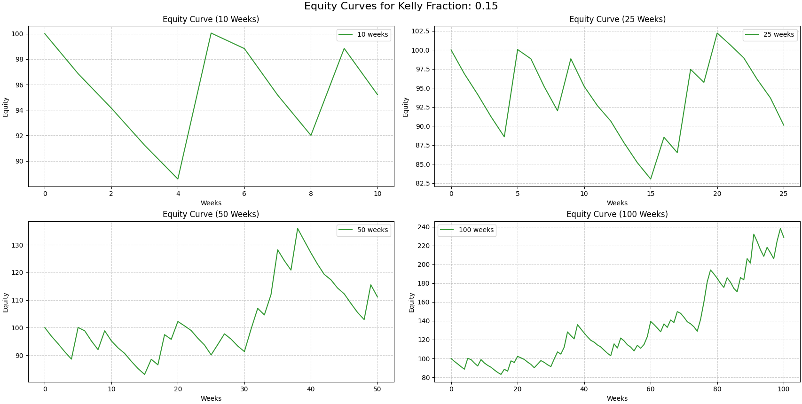
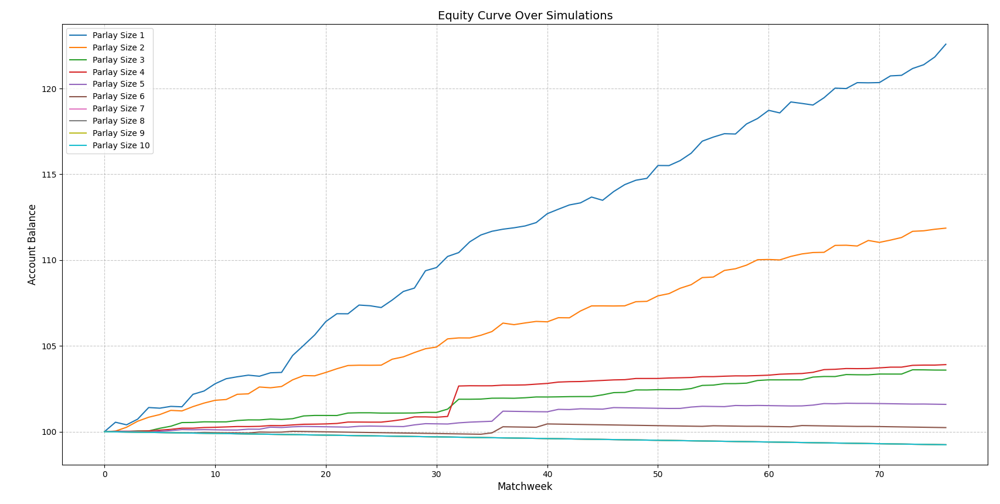
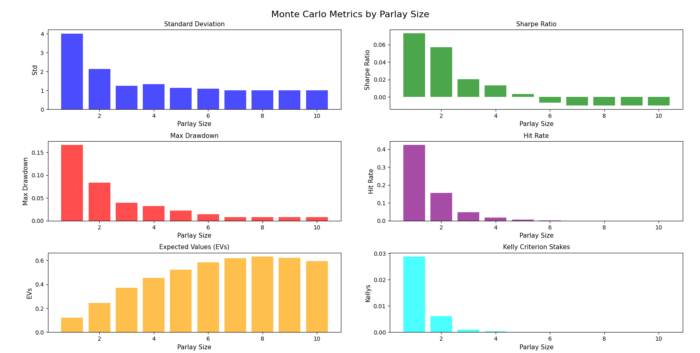

# Positive EV Betting in the Premier League

I’m a football fan who likes to bet and also likes math. I thought it would be cool to see how some of the concepts I’ve learned can be applied to betting on football.

---

# WORK IN PROGRESS DO NOT TRUST GRAPHS

---

# Initial Approach

## Understanding The Strategy

I use Opta’s supercomputer predictions, which crunch all kinds of stats to predict match outcomes like home wins, draws, and away wins. Then, I compare those probabilities to what the betting sites are offering. When there’s a big difference, that’s where I dig in. I calculate expected value (EV) to figure out if a bet is worth it. Basically, it’s about betting when Opta’s numbers suggest a better chance than the odds imply. I stick to bets with a clear edge and keep track of everything to see how it plays out over time. That said, there are a few risks to watch out for: Opta’s predictions aren’t always perfect—unexpected injuries or game-day surprises can throw things off. Odds from betting sites can change fast, too, so a good opportunity might disappear before you can act. And even with a positive EV, betting has its ups and downs, so you’ve got to manage your bankroll carefully to handle any losing streaks. With patience though, the goal is to turn those small advantages into steady gains.

## Collecting The Data

In order to find the expected value of any bet, I need the probabilities of the thing I will be betting as well as the return on that bet. To start with, I grabbed matchday odds from a local betting app, and got predictions from Opta’s supercomputer to get probabilities for win, draw, and loss for each match.

The expected value tells me how much I should expect over a long run to win per euro bet. The formula for expected value is given by:
     
$$
EV = P(\text{parlay win}) \cdot (\text{combined odds} - 1) - (1 - P(\text{parlay win})).
$$

where the combined odds are the multiplication of all individual odds for each match in a parlay, given by:

$$
P(\text{combined odds}) = \prod_{i=1}^{j} o_i
$$

where j is the number of bets in the parlay.

The probability of winning is calculated from probability of all outcomes in the parlay hitting:

$$
P(\text{parlay win}) = \prod_{i=1}^{n} P_i
$$

where n is the number of matches in a matchweek.

## Running Numbers

After collecting the data, I ran every single parlay combination, and sorted by the EV in order to find the highest paying bets. For each parlay, I returned 3 different parameters: the probability of it hitting, the EV, and the combined odds of the parlay. With this information I picked the parlay with the highest EV and visualised some of the returns.

### High-EV, High Match Parlays

The most profitable parlays were aways those with the highest number of matches strung together. Of course in this way we would get ridiculously high odds - some as big as 7745 (winning 7745 euro on a 1 euro bet). The problem with such parlays is that they had probabilities just as low to match the high payouts. A commoon probability for such parlays would be in the 0.0005% - 0.007% range. 

The reality was shown in the following equity curve. It would be slow and dreary wait to become profitable. Not to mention that the minimum wait time was at least 1000 weeks.

---

# Risk

The question is now how much I should bet per parlay. The kelly criterion explains a method in order to determine how much I should risk per bet, according to formula:

$$
f^* = \frac{bp-q}{b}
$$

where:
- $f^*$ is the bet size.
- $b$ is the net odds.
- $p$ is the probability of winning.
- $q = (1-p)$ is the probability of losing.

This means that for every matchweek, we size our bets differently, according to the specific odds, and probabilities we get. Note that the strategy will remain the same, we still aim for high probability bets, but we vary how much we bet according to the criterion. For example in matchday 20, as an arbitrary choice of a parlay, we have Probability: 0.4347, and Combined Odds: 4.73241. Thus we get bet size as:

$$
f^* = \frac{4.73241*0.4347-(1-0.4347)}{4.73241} = 0.3619
$$

This result indicates that I should bet 36.19% of my account balance on this bet. The problem with such a high number is that if 3 bets go wrong in a row, I bust. Following the original binomial distribution the probability of that occouring is 0.296. In other words almost 1/3 of the time, if I follow such a high risk, I will tend to lose my account. To account for this, I plotted the time to be profitable against a fraction of the kelly criterion in steps of 0.05 from 0 to 1:

Which shows that 0.05, 0.1, and 0.15 to be the lowest time to profit. In this case, this would make sense. By minimizing my risk, I can still keep playing the game. Below are the balance curves for each of the three kelly fractions. By intuition it would make most sense to take the 0.15, as we maximise our profit while minimizing our risk in the trade off. 

Our new formula, for all matchweeks will be:

$$
f^* = \frac{0.15\cdot(bp-q)}{b}
$$

# Finding The Optimal Parlay Size (n)

To address the trade-off between profitability and reliability, I did Monte Carlo simulations. With a parlay size of $n=10$, profitability is maximized, but reliability is significantly reduced as thousands of matchweeks may pass before hitting a parlay. Conversely, a parlay size of $n=1$ offers the most reliability but at the cost of lower profitability.

Running simulations in the context of football is hard. A high number of simulations might be unrealistic, and the inherent volatility of probabilities and their associated odds must be accounted for. This introduces multiple factors to consider.

For these limitations of simulation numbers, I used multiple random seeds to generate varying scenarios for the same events. For changing probabilities and odds, I used stratified sampling, using a uniform distribution across the number of simulations to get a range of probabilities and odds. To reduce the impact of large changes between probabilities within each matchweek, I made sure that the stratification remained within a predefined range. After running these simulations, I generated the following graphs:

It is interesting to understand the sense behind these metrics. Although in the long run, higher parays achieve higher EVs, it is simple for us to note that two seasons just isnt enough even for parlays bigger than five to find profitability. I ran this simulation over 1000 seeds and we find profitability for parlays up to 5! Now I ask myself the question, can I diversify my bets by including positive EV parlays for matches I havent bet on? I ran simulations for four different combination bets, following the distribution below:

| Parlay Size | Outcome 1 | Outcome 2 | Outcome 3 | Outcome 4 |
|-------------|-----------|-----------|-----------|-----------|
| 1           | 1         | 1         | 3         | 4         |
| 2           | 1         | 3         | 2         | 3         |
| 3           | 1         | 1         | 1         | 0         |
| 4           | 1         | 0         | 0         | 0         |

I can now also remove parlays greater than and equal to 5. They provide probabilities too low to be worth it to bet on. Now it is important to note that each combination adds up to ten matches. This means that I essentially bet on every single match every matchweek. In each combination bet, one match is only used once. This avoids redundancy in the bets. 

| Parlay Size | Outcome 1 | Outcome 2 | Outcome 3 | Outcome 4 | Outcome 5 | Outcome 6 |
|-------------|-----------|-----------|-----------|-----------|-----------|-----------|
| 1           | 2         | 3         | 4         | 5         | 6         | 4         |
| 2           | 2         | 2         | 2         | 2         | 2         | 3         |
| 3           | 0         | 0         | 0         | 0         | 0         | 0         |
| 4           | 0         | 0         | 0         | 0         | 0         | 0         |

# Further Exploration

1. Different bookmakers have different odds. A change of 0.05 is huge for EV.
2. Different football prediction websites? Which ones are reliable, and stats and data driven?
3. Timing of bet. Odds get worse closer to match day. Betting for matchweek n right after matchweek n-1 may be the best time.
