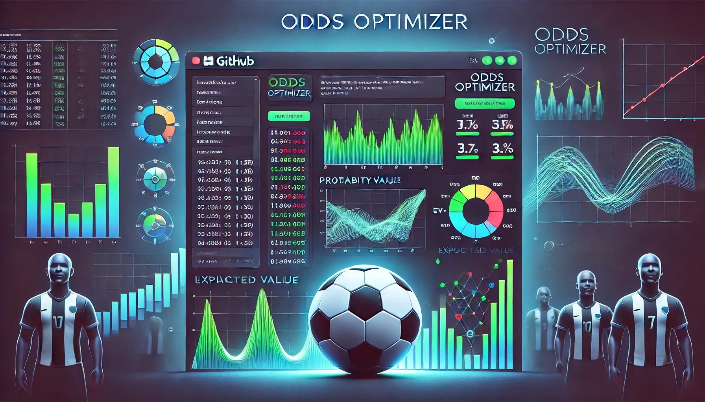

# Positive EV Betting in the Premier League

I’m a football fan who likes to bet and also likes math. I thought it would be cool to see how some of the concepts I’ve learned can be applied to betting on football.

---

# Initial Approach

## Collecting the Data

In order to find the expected value of any bet, I need the probabilities of the thing I will be betting as well as the return on that bet. To start with, I grabbed matchday odds from a local betting app, and got predictions from Opta’s supercomputer to get probabilities for win, draw, and loss for each match.

The expected value tells me how much I should expect over a long run to win per euro bet. The formula for expected value is given by:
     
$$
EV = P(\text{parlay win}) \cdot (\text{combined odds} - 1) - (1 - P(\text{parlay win})).
$$

where the combined odds are the multiplication of all individual odds for each match in a parlay, given by:

$$
P(\text{combined odds}) = \prod_{i=1}^{j} o_i
$$

where j is the number of bets in the parlay.

The probability of winning is calculated from probability of all outcomes in the parlay hitting:

$$
P(\text{parlay win}) = \prod_{i=1}^{n} P_i
$$

where n is the number of matches in a matchweek.

Note: for some matches I used my own intuition. Specifically, for matchday 20 of the 24/25 PL season the supercomputer had liverpool winning against manchester unite at 71%. In this sense, I used my own judgement and put the win percentage to 100.

## Running Numbers

After collecting the data, I ran every single parlay combination, and sorted by the EV in order to find the highest paying bets. For each parlay, I returned 3 different parameters: the probability of it hitting, the EV, and the combined odds of the parlay. With this information I picked the parlay with the highest EV and visualised some of the returns.

### High-EV, High Match Parlays

The most profitable parlays were aways those with the highest number of matches strung together. Of course in this way we would get ridiculously high odds - some as big as 7745 (winning 7745 euro on a 1 euro bet). The problem with such parlays is that they had probabilities just as low to match the high payouts. A commoon probability for such parlays would be in the 0.0005% - 0.007% range. 

The reality was shown in the following equity curve. It was a slow and dreary wait to become profitable. Not to mention that the minimum wait time was at least 1000 weeks.

---

### High-EV, Lower Match Parlays

I modeled each parlay under the binomial distribution. Each match has three potential outcomes, each with a probability of $\frac{1}{3}$. For the sake of simplicity, I focused on betting on just one of those outcomes for each match. This setup allowed me to calculate the probabilities of hitting a parlay with different numbers of matches.

By plotting the binomial distribution, I could visualize how the probability of success changes as the number of matches ($n$) in a parlay increases. This gives insight into which $n$ has the highest probability of hitting and can help guide the strategy toward more frequent wins while managing risk.

In this case the highest hitting number was three!

We can now adjust our initial calculation to limit the number of matches in a single parlay to 3. Of these calculations 2 different strategies can be considered. One is in prioritising probability over expected value, and the other to prioritise expected value. Taking matchday 20 as an example, we have 2 different entries:

Parlay 1: [('Tottenham vs Newcastle', 'Win'), ('Liverpool vs Man United', 'Win'), ('Wolves vs Nottingham Forest', 'Loss')], EV: 1.4940742400000002, Probability: 0.28350000000000003, Combined Odds: 8.79744

Parlay 7: [('Fulham vs Ipswich Town', 'Win'), ('Liverpool vs Man United', 'Win'), ('Wolves vs Nottingham Forest', 'Loss')], EV: 1.0571812352000003, Probability: 0.4347, Combined Odds: 4.732416000000001, Ratio: 91.85583008763388

Plotting both equity curves for much smaller timeframes, we see that for parlay 1:

We see that we see profitability at around week 18, with a much faster comeback and a much smaller drawdown. For parlay 7:

Which is quite similar to parlay 1, with a smaller drawdown, and faster profitability.

## Picking the Trade-off

An important thing to note is that the fixtures change every week, along with the odds! Achieving a positive EV of 1.49 may not always be possible. In that sense, we must try to stick as closely as possible to 1 strategy, that may appear more reliably. In this case, achieving an EV of over 1.05, with at least a probability of 0.4 should be our goal. In other words, we aim for higher probability reliable 3 way parlays.

